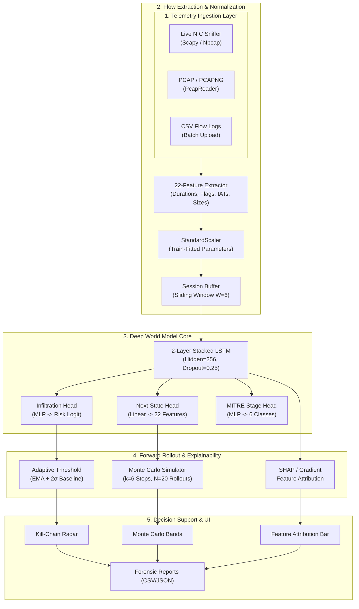

# Project Garud Architecture

Project Garud is a React/Vite security dashboard backed by a FastAPI service. The backend ingests network-flow telemetry, normalizes it into 22 features, evaluates six-flow windows with a PyTorch LSTM, persists operational state in SQLite, and exposes REST and WebSocket APIs for the dashboard.

## System Diagram

The following diagram is also shown in the [README](README.md#system-architecture).

## Runtime Components

### Ingestion and preprocessing

- `capture/` contains shared flow reconstruction, packet parsing, live capture, and signature detection.
- `backend/app/routes/ingest.py` accepts individual flows and CSV uploads.
- `backend/app/routes/pcap.py` reconstructs flows from PCAP/PCAPNG input.
- `backend/app/ingestion.py` validates records, resolves sessions, updates buffers, persists data, and triggers inference.
- `backend/app/model_loader.py` loads `world_model.pt`, `scaler.pkl`, and `config.json` from `backend/artifacts/`.

All model inputs use the configured 22-feature order. The scaler is fitted during training and reused at inference. A six-flow session window is required before the sequence model produces its primary prediction.

### Model and forecasting

The production flow model is a two-layer LSTM with three output heads:

1. Next-state regression predicts the next 22-feature vector.
2. The infiltration head produces the binary risk score used by alerting.
3. The stage head predicts one of six dataset-derived labels.

`backend/app/inference.py` performs single-window prediction and autoregressive forecast rollouts. Monte Carlo input noise provides a forecast spread. The adaptive threshold uses the configured alert baseline and EMA smoothing. These labels are operational proxies, not proof of a real multi-stage campaign.

The repository also contains the network-state experiment and served V3 path under `worldmodel_v2/`, `worldmodel_v3/`, `backend/app/network_state.py`, and `backend/artifacts_v3/`. It aggregates flows into one-minute state vectors and exposes the network forecast route.

### Persistence and APIs

`backend/app/database.py` owns the async SQLite models for flows, sessions, alerts, and cycle archives. The FastAPI application in `backend/app/main.py` registers route modules for:

- Prediction and forecasting: `/predict`, `/forecast`.
- Ingestion: `/ingest`, `/ingest/csv`, `/ingest/pcap`.
- Explainability: `/explain` and export/view variants.
- Network state and topology: `/network/*`, `/topology`, and GeoIP routes.
- Alerts, reports, MITRE mappings, system controls, and WebSocket sessions.

Optional `X-API-Key` authentication, CORS, rate limiting, Pydantic validation, and security headers are applied by the backend middleware. `/health` and the OpenAPI endpoints provide service diagnostics.

### Frontend

`frontend/src/App.jsx` owns navigation, health polling, system controls, and the WebSocket connection. Dashboard, network forecast, alert, explainability, report, ingestion, live-log, topology, and settings components consume the backend through `frontend/src/api.js`.

## Training and Evaluation

Dataset preparation and augmentation live under `data/`. `pipeline_fixed.py` trains the flow model and writes the production artifact directory. `worldmodel_v2/` and `worldmodel_v3/` contain the network-state training and evaluation workflow. `experiments/` contains calibration, model evaluation, parity, family-holdout, replay, and threshold experiments. Results in JSON and CSV files are recorded experiment outputs, not automatic retraining.

Retraining is manual. The resulting weights, scaler, and configuration must be kept together before deployment. Backend tests cover inference, API behavior, flow semantics, signatures, network state, graph behavior, security, and explainability.

## Deployment Boundaries

The backend and frontend run directly in Python and Node environments. SQLite stores local service state; model artifacts are read from the configured artifact directories. Environment variables are documented in `.env.example`.

## Limitations

- Stage labels are derived from public dataset labels and do not represent verified attacker progression.
- PCAP/live visibility depends on capture permissions and available interfaces.
- Model quality depends on dataset coverage and can degrade under network or attack-family shift.
- The network-state forecast is a separate experimental/served path from the six-flow model and should be evaluated with its own documented metrics.
